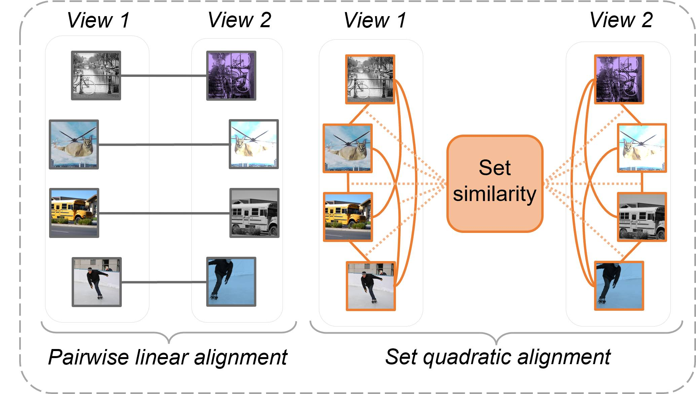

PyTorch implementation of the paper:

*"Contrasting quadratic assignments for set-based representation learning"* (2022), Moskalev, A., and Sosnovik, I., *European Conference on Computer Vision (ECCV)*, [[arXiv]](https://arxiv.org/abs/2205.15814)


```bibtex
@inproceedings{moskalev2022contrasting,
  title={Contrasting quadratic assignments for set-based representation learning},
  author={Moskalev, Artem and Sosnovik, Ivan and Volker, Fischer and Smeulders, Arnold},
  booktitle={European Conference on Computer Vision},
  year={2022}
}
```

👾 Check the <a href="https://www.youtube.com/watch?v=-3ajh8VNKIA">video</a> on the paper. 👾

*Abstract*: The standard approach to contrastive learning is to maximize the agreement between different views of the data. The views are ordered in pairs, such that they are either positive, encoding different views of the same object, or negative, corresponding to views of different objects. The supervisory signal comes from maximizing the total similarity over positive pairs, while the negative pairs are needed to avoid collapse. In this work, we note that the approach of considering individual pairs cannot account for both intra-set and inter-set similarities when the sets are formed from the views of the data. It thus limits the information content of the supervisory signal available to train representations. We propose to go beyond contrasting individual pairs of objects by focusing on contrasting objects as sets. For this, we use combinatorial quadratic assignment theory designed to evaluate set and graph similarities and derive set-contrastive objective as a regularizer for contrastive learning methods. We conduct experiments and demonstrate that our method improves learned representations for the tasks of metric learning and self-supervised classification.


<p align="center">
  
</p>


Essential code
--------------

The repository contains the essential code of QARe and SparceCLR. Currently, we are working on cleaning the code and providing more detailed instructions on how to run the methods.

*Methods*: `simclr_qare`, `sparceclr`, `sparceclr_qare`. The implementation of the rest of the methods is based on [this repo](https://github.com/mpatacchiola/self-supervised-relational-reasoning).

*Datasets*: `cifar10`, `cifar100`, `tiny` ([tiny-ImageNet](http://cs231n.stanford.edu/tiny-imagenet-200.zip)).

**1) Contrastive training**

The contrastive training is managed by the file [train_unsupervised.py](train_unsupervised.py):

```
python train_unsupervised.py --dataset="cifar10" --method="sparseclr_qare" --backbone="conv4" --seed=1 --data_size=256 --K=32 --gpu=0 --epochs=200 --alpha=1 --beta=0.5
```

The code line above will run a contrastive training with `sparseclr_qare` objective, batch size of `data_size=256` and `K=32` augmentations. The weighting factors for the pairwise / QARe terms in the contrastive loss are set to `alpha = 1` / `beta = 0.5` respectively. Checkpoints and logs will be saved into `./checkpoint/METHOD_NAME_DATASET_NAME_ARCHITECTURE_BATCH-SIZE_BACKBONE-FDIM_HEAD-FDIM_ALPHA_BETA`.

**2) Training linear probing**

Once the backbone is contrastively trained, we can test it for self-supervised classification by training a logistic regression on top of the learned features:

```
python train_linear_evaluation.py --dataset="cifar10" --method="sparseclr_qare" --backbone="conv4" --seed=1 --data_size=128 --gpu=0 --epochs=100 --checkpoint="./checkpoint sparseclr_qare_D:cifar10_Ar:conv4_BS:256_IFS:64_OFS:64_A:1.0_B:0.5/sparseclr_qare__cifar10_conv4_seed_1_epoch_200.tar"
```

The code line above will train the logistic regression on top of the features learned by the model loaded from `checkpoint`. The weights of the logistic regression will be saved into the same checkpoint folder.


**3) Testing linear probing**

The final stage involves testing the logistic regression on an unseen test set:

```
python test.py --dataset="cifar10" --backbone="conv4" --seed=1 --data_size=128 --gpu=0 --checkpoint="./checkpoint/sparseclr_qare_D:cifar10_Ar:conv4_BS:256_IFS:64_OFS:64_A:1.0_B:0.5/sparseclr_qare__cifar10_conv4_seed_1_epoch_10_linear_evaluation.tar"
```

The code line above will evaluate the logistic regression model loaded from `checkpoint` on the test split of a dataset and print classification accuracy.


Acknowledgements
-------

The Robert Bosch GmbH is acknowledged for financial support.

License
-------

Licensed under an MIT license.